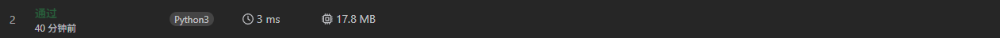
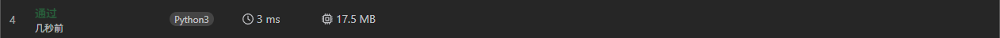

>
> 给你两个正整数 `n` 和 `m` 。
>
> 现定义两个整数 `num1` 和 `num2` ，如下所示：
>
> * `num1`：范围 `[1, n]` 内所有 **无法被 **`m`** 整除** 的整数之和。
> * `num2`：范围 `[1, n]` 内所有 **能够被 **`m`** 整除** 的整数之和。
>
> 返回整数 `num1 - num2` 。
>
> **示例 1：**
>
> <pre><strong>输入：</strong>n = 10, m = 3
> <strong>输出：</strong>19
> <strong>解释：</strong>在这个示例中：
> - 范围 [1, 10] 内无法被 3 整除的整数为 [1,2,4,5,7,8,10] ，num1 = 这些整数之和 = 37 。
> - 范围 [1, 10] 内能够被 3 整除的整数为 [3,6,9] ，num2 = 这些整数之和 = 18 。
> 返回 37 - 18 = 19 作为答案。
> </pre>
>
> **示例 2：**
>
> <pre><strong>输入：</strong>n = 5, m = 6
> <strong>输出：</strong>15
> <strong>解释：</strong>在这个示例中：
> - 范围 [1, 5] 内无法被 6 整除的整数为 [1,2,3,4,5] ，num1 = 这些整数之和 =  15 。
> - 范围 [1, 5] 内能够被 6 整除的整数为 [] ，num2 = 这些整数之和 = 0 。
> 返回 15 - 0 = 15 作为答案。
> </pre>
>
> **示例 3：**
>
> <pre><strong>输入：</strong>n = 5, m = 1
> <strong>输出：</strong>-15
> <strong>解释：</strong>在这个示例中：
> - 范围 [1, 5] 内无法被 1 整除的整数为 [] ，num1 = 这些整数之和 = 0 。 
> - 范围 [1, 5] 内能够被 1 整除的整数为 [1,2,3,4,5] ，num2 = 这些整数之和 = 15 。
> 返回 0 - 15 = -15 作为答案。
> </pre>
>**提示：**
> 
>* `1 <= n, m <= 1000`

### 解题思路：

这个题看到的第一眼会觉得很简单，直接遍历就好了，python的话更是可以直接使用列表推导式一行就可以搞定

### 参考答案一：

空间复杂度：O(n)  列表推导式是需要额外的空间 2 * n

时间复杂度：O(n) 需要遍历n次

```python
class Solution:
    def differenceOfSums(self, n: int, m: int) -> int:
        return sum([i for i in range(1, n + 1) if i % m]) - sum([i for i in range(1, n + 1) if i % m == 0])
```


### 参考答案二：

空间复杂度：O(1)  

时间复杂度：O(n) 需要遍历n次

```python
class Solution:
    def differenceOfSums(self, n: int, m: int) -> int:
        res = 0
        for i in range(1, n + 1):
            if i % m:
                res += i
            else:
                res -= i     
        return res
```



### 参考答案三：

空间复杂度：O(1)  

时间复杂度：O(n) 需要遍历n次

```python
class Solution:
    def differenceOfSums(self, n: int, m: int) -> int:
        return sum(i if i % m else -i for i in range(1, n + 1))
```


